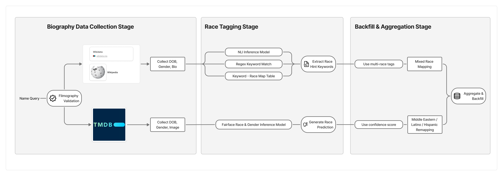

# Film Research Data Collection Pipeline

This repository includes codes of data collection & processing pipeline for film industry professional data.

# Source Data

```bash
data/Director-Producer-Exec_Producer-Screenwriter.xlsx
data/Leading and Leading Ensemble Actor.xls
```

Source data includes the following information of 20,901 Leading / Leading ensemble actors, 78,496 Director / Producer / Screenwriters:

* Movie ODID: Unique identifier of movie
* display_name: Title of movie they participated in
* billing: Billing amount
* person_odid: Unique identifier of person
* person : Full name of the person
* role: Role category of the person

The source data was collected from the-numbers.com

## Sample data for Validation 

Since entire pipeline code running requires time and resource, this repository support test-running using sampled dataset. 

``` 
bash run_pipeline.sh --sample
```

This will use SAMPLED_ data for running data collection pipeline, which only include people participated in first 50 movies.

# Output data

```
Final_Output/movie_ppl_aggregate.csv
Final_Output/movie_ppl_mainrole_DirectorProducer_aggregate.csv
Final_Output/movie_ppl_mainrole_DirectorScreenwriter_aggregate.csv

```

## Original Data & Tagging Information

| Column          | Type             | Description                                                  | Example / Allowed values                                     |
| --------------- | ---------------- | ------------------------------------------------------------ | ------------------------------------------------------------ |
| `movie_odid`    | integer / string | Internal movie ID used across the pipeline.                  | `10100`                                                      |
| `display_name`  | string           | Movie title (display-friendly).                              | `Titanic`                                                    |
| `billing`       | integer          | Cast/credit order (lower = higher billing).                  | `1`, `2`, `3`                                                |
| `person_odid`   | integer / string | Internal person ID used across the pipeline.                 | `39750401`                                                   |
| `person`        | string           | Person name as originally collected from credits.            | `Leonardo DiCaprio`                                          |
| `character`     | string / null    | On-screen character name (cast only).                        | `Jack Dawson`                                                |
| `type`          | string / null    | High-level credit type (e.g., `Leading`, `Supporting`). Crew can be null. | `Leading`                                                    |
| `role`          | string / null    | Specific crew role; null for cast rows.                      | `Director`, `Screenwriter`, `Producer`, `Executive Producer` |
| `person_name`   | string           | Canonicalized person name used for joins.                    | `James Cameron`                                              |
| `DOB`           | date / null      | Date of birth; format `YYYY-mm-dd`. If only year known, stored as `YEAR-01-01`. | `1974-11-11`, `1954-01-01`                                   |
| `DOB_source`    | string           | Source of DOB.                                               | `TMDB`, `Wiki_document`                                      |
| `Gender`        | string / null    | Final gender label.                                          | `Male`, `Female`                                             |
| `Gender_source` | string           | Source of gender.                                            | `TMDB`, `Wiki_document`, `TMDB Image Prediction model`       |
| `race_final`    | string / null    | Final race label after mapping/merging.                      | `White`, `Black`, `Asian`, `Native American/ Pacific Islanders`, `Mixed,`  `Latino / Hispanic` |
| `race_source`   | string           | Provenance for `race_final`.                                 | `Wikipedia`, `TMDB_Image_FairfaceModel`                      |

## Pre-mapping Race Information by Source

| Column                 | Type             | Description                                                  | Example / Allowed values         |
| ---------------------- | ---------------- | ------------------------------------------------------------ | -------------------------------- |
| `race_scores_fair`     | float[ ]         | FairFace (or equivalent) **7-class** probability vector in model-native order. Used as input to mapping that yields `race_final`. | `[0.5519, 0.0022, …, 0.0185]`    |
| `wiki_race_tag`        | string / null    | Single race tag parsed from Wikipedia prose/infobox when confidently identified. | `White`                          |
| `wiki_race_tag_clues`  | string[ ] / null | Ethnicity/nationality hints extracted from text (free-text list). | `['Italian','Russian','German']` |
| `wiki_multi_race_tags` | string[ ] / null | All race tags inferred from text if multiple hints found (pre-merge). | `['White']`                      |
| `race_predicted`       | string / null    | Model-only race label before merging with text hints (pre-final). | `White`                          |

## Person Category

| Column            | Type    | Description                      | Example / Allowed values |
| ----------------- | ------- | -------------------------------- | ------------------------ |
| `in_actorlist`    | boolean | Person appears in cast.          | `TRUE` / `FALSE`         |
| `in_directorlist` | boolean | Person appears in director list. | `TRUE` / `FALSE`         |

## Tag Presence Flags (row-level completeness)

| Column           | Type    | Description                                         | Example / Allowed values |
| ---------------- | ------- | --------------------------------------------------- | ------------------------ |
| `Race_present`   | boolean | `race_final` is non-null for this person-movie row. | `TRUE` / `FALSE`         |
| `DOB_present`    | boolean | `DOB` is non-null for this person-movie row.        | `TRUE` / `FALSE`         |
| `Gender_present` | boolean | `Gender` is non-null for this person-movie row.     | `TRUE` / `FALSE`         |

## Movie Level Stat (Use Filter to Sample Out Movies)

| Column            | Type        | Description                                                  | Example / Allowed values |
| ----------------- | ----------- | ------------------------------------------------------------ | ------------------------ |
| `total_people`    | integer     | Number of credited people considered for this movie (denominator for coverage). | `6`                      |
| `dob_coverage`    | float (0–1) | Share of credited people with non-null `DOB`.                | `1.0`, `0.83`            |
| `gender_coverage` | float (0–1) | Share of credited people with non-null `Gender`.             | `1.0`, `0.92`            |
| `race_coverage`   | float (0–1) | Share of credited people with non-null `race_final`.         | `1.0`, `0.75`            |

# Data Source & Processing Logic



## 1) Biography Data Collection Stage

- **Filmography validation (disambiguation)**: given a *Name Query*, match the correct person by cross-checking movie credits (cast/crew).
- **Wikipedia / Wikidata →** collect **DOB, Gender, Bio text** for text-based tagging.
- **TMDb API →** collect **DOB, Gender directlr from API, **, and **Profile Image** for model inference.

**Sources**

- Wikipedia — https://en.wikipedia.org/
- Wikidata — https://www.wikidata.org/
- TMDb (The Movie Database) — https://www.themoviedb.org/ (API)

## 2) Race Tagging Stage

### A) Text pipeline (from Wikipedia/Wikidata)

Produces `wiki_race_tag`, `wiki_multi_race_tags`, `wiki_race_tag_clues`.

- **NLI inference signals**: lightweight entailment checks on bio sentences (“X is [race]”) to surface likely tags.
- **Regex / keyword match**: extract ethnonyms, nationality terms, and race words from bios/infoboxes.
- **Keyword → Race map**: a curated mapping table collapses extracted terms into the project’s race schema
  *(e.g., ethnonyms and regional cues → {White, Black, Asian, Native American} or “Latino/Hispanic/Middle-Eastern” pre-tags).*

### B) Image pipeline (from TMDb profile image)

Produces `race_scores_fair` (7-class probabilities) and `race_predicted`.

- **FairFace race & gender model** on the TMDb profile image.
  Paper: *FairFace: Face Attribute Dataset for Balanced Race, Gender, and Age* — https://arxiv.org/abs/1908.04913

## 3) Backfill & Aggregation Stage

### Merge & Priority (TL;DR)

Final label goes to `race_final`, provenance to `race_source`.

1. **If multiple explicit text tags** (`wiki_multi_race_tags` > 1) → **`race_final = Mixed`**, `race_source = Wikipedia`.
2. **If a single, explicit wiki race tag** and the model doesn’t strongly contradict → **prefer `wiki_race_tag`**.
3. **Else** (no/weak wiki signal), **use FairFace** top class (`race_predicted`) with **confidence**; set `race_source = TMDB_Image_FairfaceModel`.
4. **If both signals are weak/absent**, leave null (or mark as **Mixed** when neither dominates).
5. **Backfill** DOB/Gender from the most reliable available source (TMDb, Wikipedia; mark with `*_source`).
6. **Aggregate movie-level coverage** (`total_people`, `dob_coverage`, `gender_coverage`, `race_coverage`) for downstream filtering.

### Special remapping policy (research framing)

- **Latino / Hispanic** are treated as *ethnicity* labels that can span multiple races.
  - **If FairFace scores exist**: **reclassify to `White` or `Black`** based on the higher model probability (tie/low-confidence → keep **Mixed**).
  - **If FairFace scores do \*not\* exist** and the **wiki keywords** indicate *Latino/Hispanic*: **keep as `Latino/Hispanic`** (source = wiki text).
- **Middle Eastern** are mapped into **White race.** 

| Source             | Used for                                                     | Notes / Link                                                 |
| ------------------ | ------------------------------------------------------------ | ------------------------------------------------------------ |
| **Wikipedia**      | Bio text for NLI/regex keywords; sometimes DOB/Gender        | [https://en.wikipedia.org/](https://en.wikipedia.org/)       |
| **Wikidata**       | Supplemental structured attributes and aliases               | [https://www.wikidata.org/](https://www.wikidata.org/)       |
| **TMDb**           | DOB, Gender, **Profile Image** (for model inference)         | [https://www.themoviedb.org/](https://www.themoviedb.org/)   |
| **FairFace model** | **Race probabilities** from image (`race_scores_fair`) → `race_predicted` | Paper: [https://arxiv.org/abs/1908.04913](https://arxiv.org/abs/1908.04913) / Repo: https://github.com/dchen236/FairFace |

# Code Library Requirement / How to run

Recommend using virtual environment, and set up for requirements.

```bash
python -m venv .venv && source .venv/bin/activate   # Windows: .venv\Scripts\activate
pip install -r requirements.txt

# Or, if using pipenv:
pipenv install --dev
pipenv shell
```

## TMDb API key (required)

Set your TMDb key before running the pipeline (either method works):

```
# macOS/Linux
export TMDB_API_KEY="YOUR_TMDB_KEY"

# Windows (PowerShell)
setx TMDB_API_KEY "YOUR_TMDB_KEY"
```

## Running Pipeline

### Entire Pipeline (Warning: this will take a lot of time)

```
# (first time only)
chmod +x run_pipeline.sh clean_pipeline_outputs.sh

# full run on the main dataset
./run_pipeline.sh

# optional: clean intermediates / caches / large outputs
./clean_pipeline_outputs.sh
```

### Sample Test Pipeline

```
# If a dedicated script exists:
./run_pipeline_sample.sh

# Or, if the main script supports a flag:
./run_pipeline.sh --sample

# Or, if the script uses an env toggle:
RUN_MODE=sample ./run_pipeline.sh
```

**Important:** The **sample pipeline is only for sanity-check** of the end-to-end flow.
Because the sample dataset is intentionally small/synthetic, **tagging results may differ from the final, full dataset**(coverage, class distribution, and “Latino/Hispanic” remapping behavior can all vary in sample mode).
